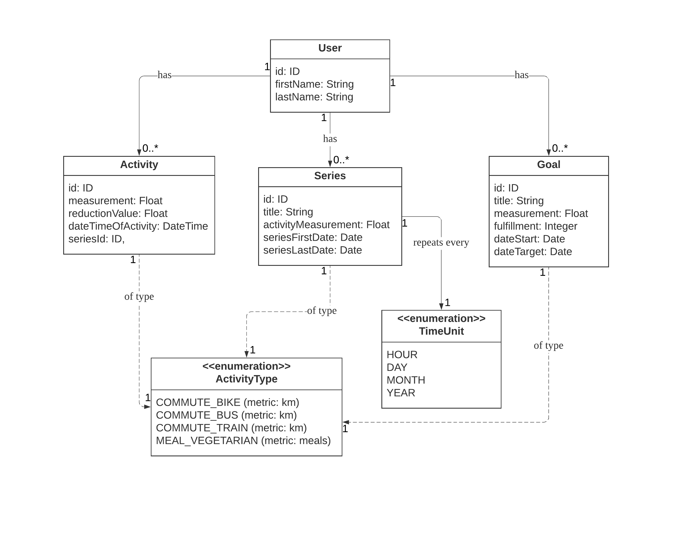
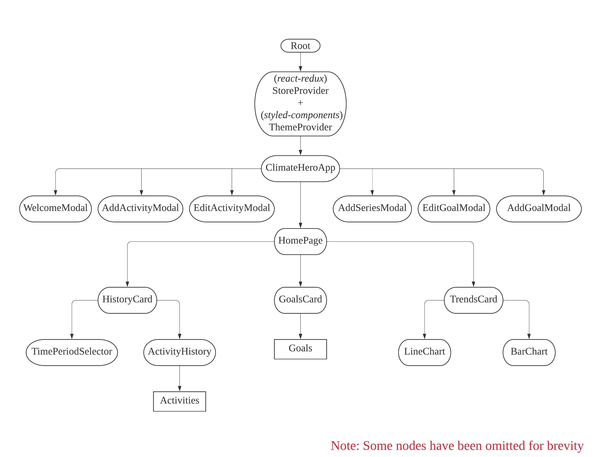

## An Overview of the Client Application

The front end of ClimateHero was designed to be a convenient and safe means for users to interact with the server and its data, and in doing so, hopefully motivating them to reduce their carbon footprints in their daily lives.

## Technologies Used

The frontend is a [Single Page Application](https://medium.com/@NeotericEU/single-page-application-vs-multiple-page-application-2591588efe58) built mainly using [React](https://reactjs.org/docs/getting-started.html), while in-app states are managed using [React-Redux](https://react-redux.js.org/introduction/quick-start). Thus, a good grasp of the two technologies will go a long way towards contributing to this project. The application is hosted on the SAP Cloud Platform, via the [Cloud Foundry CLI](https://docs.cloudfoundry.org/cf-cli/install-go-cli.html). This documentation is written using [Docusaurus](https://docusaurus.io/docs/en/installation).

On a more detailed note, the application uses the following libraries/packages:

(Non-exhaustive, some common/axiomatic libraries, such as "react" or "lodash" have been omitted for brevity)

-   [@ui5/webcomponents-react](https://sap.github.io/ui5-webcomponents-react/?path=/docs/1-welcome-getting-started--page) - UI component library with SAP-compliant styles.
-   [axios](https://github.com/axios/axios) - sending and receiving data from the server via XMLHttpRequests.
-   [moment](https://momentjs.com/) - management of date and time within the client.
-   [prettier](https://prettier.io/) - code formatting.
-   [react-datepicker](https://reactdatepicker.com/) - self-explanatory, preferred over its UI5 counterpart due to ease of use.
-   [react-time-picker](http://projects.wojtekmaj.pl/react-time-picker/) - as above.
-   [redux-logger](https://github.com/LogRocket/redux-logger) - enables in-browser logging of redux state changes.
-   [redux-thunks](https://github.com/reduxjs/redux-thunk) - Thunk middleware for Redux. Learn about thunks [here](https://medium.com/fullstack-academy/thunks-in-redux-the-basics-85e538a3fe60).

## An Overview of the File Structure

Currently the file/folder structure looks roughly like this:

```text
/cf
    /build (the build directory which CF will deploy with. More information in the "Deployment" section below)
    ... some config files
/docs (markdown documentation files)
/public
/src
    /Assets
    /Components (React components)
    /constants (app-wide constants)
    /Pages
    /redux
    /util (common utilities)
/website (docusaurus-related files)
.eslintrc.json
.gitignore
manifest.yml
package.json
xs-security.json (app security configs)
```

## Application Architecture

Broadly speaking, the application consists of two parts - the Redux state machine and the React view layer, with a one-way data flow from the former to the latter - true to the [React Core Principles](https://reactjs.org/docs/thinking-in-react.html). There are 4 main objects that represent and comprise the application state are Activities, Goals, Series and Users.

Here is a UML class diagram demonstrating their attributes and the associations between them:



The above would be a repesentation of the "Model" in the MVC framework. We now move on to discuss the view layer. This is what our React component tree roughly looks like:



## Current State of Development

As of the writing of this document (1 May 2020), the application is in its MVP (Minimum Viable Product) stage.

## Future Improvements

## [Deployment](#deployment)

As mentioned at the beginning of the page, ClimateHero is hosted on the SAP Cloud Platform, via the Cloud Foundry CLI. To deploy an updated version of the application, there are roughly 2 steps.

### 1. Build the application

This is done by running the npm script:

```bash
npm run buildCF (Mac/Linux)
npm run buildCFWindows (Windows)
```

The above two commands are custom npm scripts which translate into the following respectively:

```bash
react-scripts build && rm -rf ./cf/build && mv ./build ./cf/build
react-scripts build && DEL /F/Q/S cf\\build > NUL && RMDIR /Q/S cf\\build && move build cf\\
```

### 2. Push the application

```bash
cf push
```

The above command will push the application to the cloud, adopting its configurations from the `manifest.yml` file. More information on how to configure the manifest attributes can be found [here](https://docs.cloudfoundry.org/devguide/deploy-apps/manifest-attributes.html).
